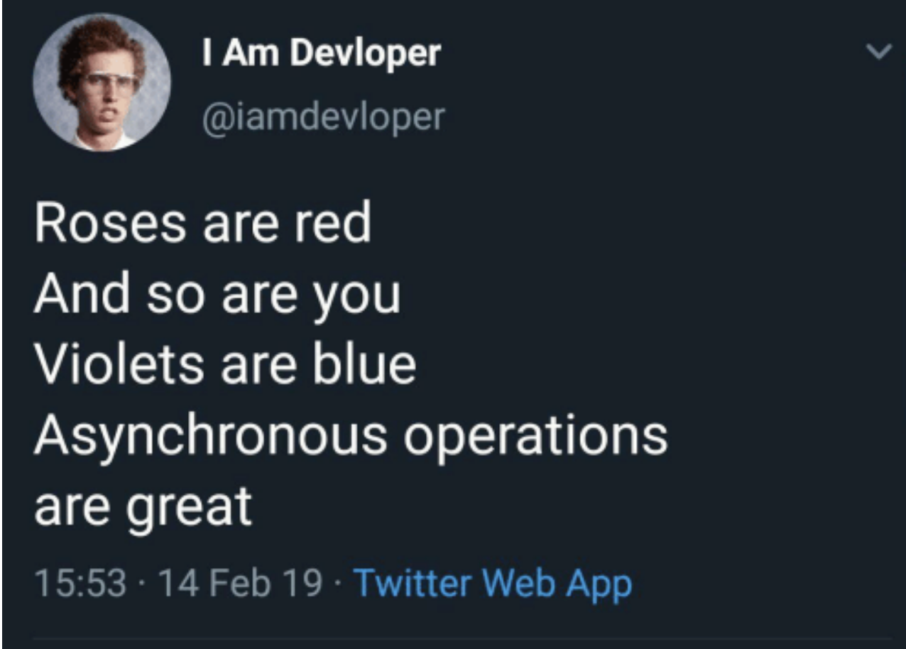

<h1>0x02-python_async_comprehension</h1>

<h1>Resources</h1>
<li><a href="https://intranet.alxswe.com/rltoken/hlwtED-iLsdORSgly8DsyQ">PEP 530 – Asynchronous Comprehensions</a></li>
<li><a href="https://intranet.alxswe.com/rltoken/0OkbObYzCKtO7ZUAxfKvkw">What’s New in Python: Asynchronous Comprehensions / Generators</a></li>
<li><a href="https://intranet.alxswe.com/rltoken/l4Fnno568VbVIn9GvrFVtQ">Type-hints for generators</a></li>

<h2>Tasks</h2>
<h3>0. Async Generator</h3>

Write a coroutine called async_generator that takes no arguments.

The coroutine will loop 10 times, each time asynchronously wait 1 second, then yield a random number between 0 and 10. Use the random module.

<pre>
bob@dylan:~$ cat 0-main.py
#!/usr/bin/env python3

import asyncio

async_generator = __import__('0-async_generator').async_generator

async def print_yielded_values():
    result = []
    async for i in async_generator():
        result.append(i)
    print(result)

asyncio.run(print_yielded_values())

bob@dylan:~$ ./0-main.py
[4.403136952967102, 6.9092712604587465, 6.293445466782645, 4.549663490048418, 4.1326571686139015, 9.99058525304903, 6.726734105473811, 9.84331704602206, 1.0067279479988345, 1.3783306401737838]
</pre>
<b>Repo:</b>

<li>GitHub repository: alx-backend-python</li>
<li>Directory: 0x02-python_async_comprehension</li>
<li>File: 0-async_generator.py</li>
  
<h3>1. Async Comprehensions</h3>

Import async_generator from the previous task and then write a coroutine called async_comprehension that takes no arguments.

The coroutine will collect 10 random numbers using an async comprehensing over async_generator, then return the 10 random numbers.

<pre>
bob@dylan:~$ cat 1-main.py
#!/usr/bin/env python3

import asyncio

async_comprehension = __import__('1-async_comprehension').async_comprehension

async def main():
    print(await async_comprehension())

asyncio.run(main())

bob@dylan:~$ ./1-main.py
[9.861842105071727, 8.572355293354995, 1.7467182056248265, 4.0724372912858575, 0.5524750922145316, 8.084266576021555, 8.387128918690468, 1.5486451376520916, 7.713335177885325, 7.673533267041574]
</pre>
<b>Repo:</b>

<li>GitHub repository: alx-backend-python</li>
<li>Directory: 0x02-python_async_comprehension</li>
<li>File: 1-async_comprehension.py</li>
  
<h3>2. Run time for four parallel comprehensions</h3>

Import async_comprehension from the previous file and write a measure_runtime coroutine that will execute async_comprehension four times in parallel using asyncio.gather.

measure_runtime should measure the total runtime and return it.

Notice that the total runtime is roughly 10 seconds, explain it to yourself.

<pre>
bob@dylan:~$ cat 2-main.py
#!/usr/bin/env python3

import asyncio

measure_runtime = __import__('2-measure_runtime').measure_runtime

async def main():
    return await(measure_runtime())

print(
    asyncio.run(main())
)

bob@dylan:~$ ./2-main.py
10.021936893463135
</pre>
<b>Repo:</b>

<li>GitHub repository: alx-backend-python</li>
<li>Directory: 0x02-python_async_comprehension</li>
<li>File: 2-measure_runtime.py</li>